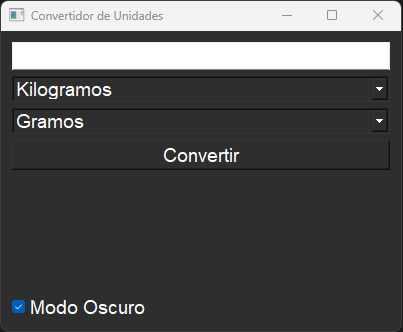
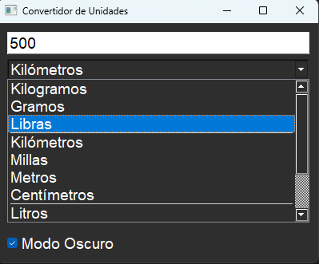
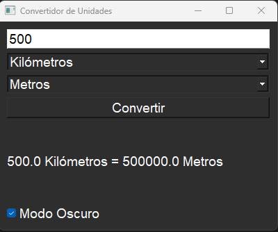

# Convertidor de Unidades 🚀

Esta es una pequeña aplicación que convierte unidades de medida de manera sencilla y rápida. 📏🔢

---

## 📋 **Características**

- **Kilos a Libras** ⚖️  
  Convierte unidades de peso.

- **Metros a Millas** 📏  
  Convierte unidades de distancia.

---

## 🖼️ **Capturas de Pantalla**

Aquí tienes algunas imágenes del funcionamiento de la aplicación:

- **Conversión de Peso**:  
  

- **Conversión de Distancia**:  
  

- **Resultado Final**:  
  

---

## 🛠️ **Tecnologías Utilizadas**

- **Python** 🐍  
  El lenguaje principal usado para construir esta aplicación.

---

## 🚀 **Cómo Ejecutar la Aplicación**

1. Asegúrate de tener **Python** instalado en tu equipo.
2. Clona este repositorio:  

   bash
   git clone https://github.com/eduardogallifaochoa/convertidor_de_unidades.git

3. Accede a la carpeta del proyecto:
cd convertidor_de_unidades
4. Ejecuta el script principal:
python ProyectoConversor.py
5. Sigue las instrucciones en la consola y realiza las conversiones necesarias. 🎉

## 🧑‍💻 **Autor**

**Eduardo Adrián Gallifa Ochoa**  
- [LinkedIn](https://www.linkedin.com/in/eduardogallifaochoa/)  
- [GitHub](https://github.com/eduardogallifaochoa)

