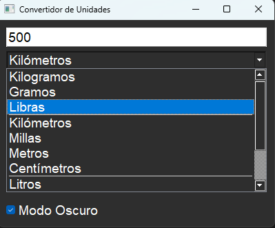
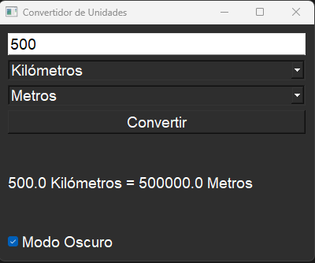

# Convertidor de Unidades 🚀

Esta es una pequeña aplicación que permite convertir unidades básicas:

- **Kilos a Libras**
- **Metros a Millas**

## Cómo usarlo
1. Ejecuta el script principal.
2. Selecciona la conversión que deseas realizar.
3. Ingresa los valores y recibe el resultado.

## Tecnologías utilizadas
- Python
- Git

## Capturas de Pantalla

